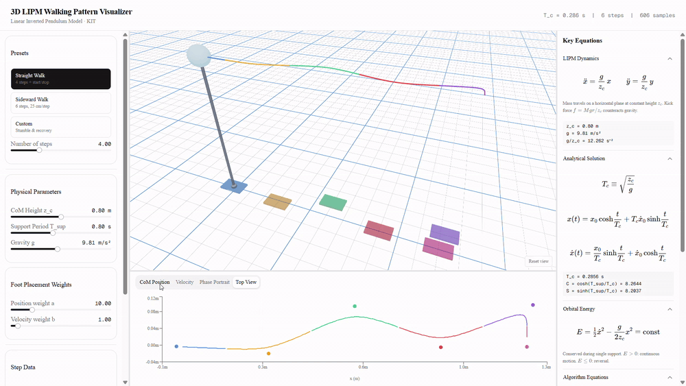

# 3D LIPM Walking Pattern Visualizer

An interactive 3D visualization of the **Linear Inverted Pendulum Model** walking pattern generator — the foot-placement algorithm from Kajita et al., implemented end to end and rendered live in the browser.



## What it does

Every parameter you change re-runs the full pattern generator and redraws the scene immediately — there is no precomputed data and no animation baking. Drag the CoM height slider and you watch the time constant `T_c`, the step timing, the foot placements and the phase portraits all move together.

- **3D viewport** — CoM trajectory colored per step, the live inverted-pendulum rod swinging from the current support foot, and clickable footprint markers for every placement.
- **Charts** — CoM position, velocity, phase portraits (`x`/`ẋ` and `y`/`ẏ`), and a top-down view of the walking path with foot placements overlaid.
- **Step table** — the computed `p*`, `x̄`, `ȳ` for each step. Click a row (or a footprint in the 3D view) to isolate that step everywhere.
- **Equations panel** — the equations actually being evaluated, with the current numeric values of `T_c`, `C`, `S` substituted in.
- **Presets** — straight walk, sideward walk, and a stumble-and-recovery case that shows the foot-placement correction doing real work.

## The model

The LIPM constrains the CoM to a horizontal plane at constant height `z_c`, which linearizes the inverted-pendulum dynamics to

```
ẍ = (g/z_c)·(x − pₓ*)        ÿ = (g/z_c)·(y − p_y*)
```

with the analytical solution used directly for integration (no numerical solver):

```
T_c = √(z_c/g)
x(t) = (x₀ − p*)·cosh(t/T_c) + T_c·ẋ₀·sinh(t/T_c) + p*
ẋ(t) = ((x₀ − p*)/T_c)·sinh(t/T_c) + ẋ₀·cosh(t/T_c)
```

The pattern generator in [lib/lipm.ts](lib/lipm.ts) is a direct transcription of the algorithm:

| Step | Meaning | Function |
| --- | --- | --- |
| 1 | Nominal foot placement recurrence `p⁽ⁿ⁾ = p⁽ⁿ⁻¹⁾ + s⁽ⁿ⁾` | `nextFootPlacement` |
| 2 | Walk primitive center `x̄`, `ȳ` from the **next** step's parameters | `walkPrimitive` |
| 3 | Walk primitive velocities `v̄ₓ`, `v̄_y` | `walkPrimitiveVelocities` |
| 4 | LIPM dynamics about the support point | `integrate` |
| 5 | Desired terminal state `xᵈ = p⁽ⁿ⁾ + x̄⁽ⁿ⁾` | `desiredState` |
| 6 | Modified foot placement `p*` minimizing `N = a(xᵈ − x_f)² + b(ẋᵈ − ẋ_f)²` | `modifiedFootPlacement` |

The last one is the interesting one: rather than stepping where the nominal plan says, the robot steps where it needs to in order to land the CoM in the right state at the end of the step. The weights `a` (position error) and `b` (velocity error) trade those two off, and both are exposed as sliders — crank `b` up on the stumble preset and watch the recovery change character.

Each step is sampled at 100 points, so the trajectory is dense enough to read the hyperbolic curvature between foot exchanges.

## Running it

```bash
pnpm install
pnpm dev
```

Then open [http://localhost:3000](http://localhost:3000).

## Controls

| Action | Input |
| --- | --- |
| Orbit the camera | Left- or right-drag |
| Fly forward / back | Scroll wheel |
| Pan | Middle-drag |
| Reset the view | Double-click, or the *Reset view* button |
| Isolate a step | Click a footprint marker or a step-table row |
| Resize a panel | Drag the divider between panels |

## Parameters

| Parameter | Symbol | Range | Default |
| --- | --- | --- | --- |
| CoM height | `z_c` | 0.4 – 1.2 m | 0.80 m |
| Support period | `T_sup` | 0.3 – 1.5 s | 0.80 s |
| Gravity | `g` | 1 – 20 m/s² | 9.81 m/s² |
| Position weight | `a` | 0.1 – 50 | 10 |
| Velocity weight | `b` | 0.1 – 20 | 1 |

Gravity is a slider on purpose — dropping it to lunar values stretches `T_c` and makes the slow, floaty gait that falls out of the same equations.

## Project layout

```
app/page.tsx                    Layout, shared state, resizable panels
lib/lipm.ts                     The pattern generator
lib/presets.ts                  Straight / sideward / stumble gait definitions
lib/types.ts                    GaitParams, StepData, TrajectoryPoint
components/viewport-3d.tsx      react-three-fiber scene
components/chart-tabs.tsx       Recharts plots
components/control-panel.tsx    Presets, sliders, step table
components/equations-panel.tsx  KaTeX equations with live values
```

## Built with

Next.js 16 · React 19 · react-three-fiber + drei · Recharts · KaTeX · Tailwind CSS v4 · shadcn/ui on Base UI
